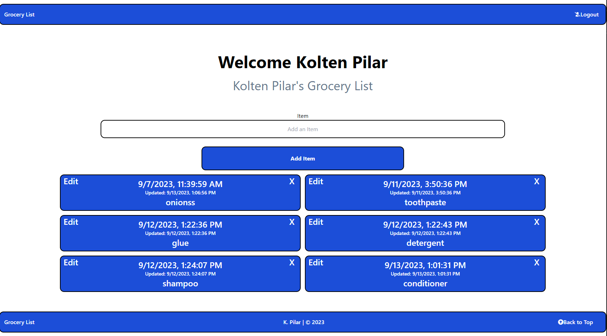
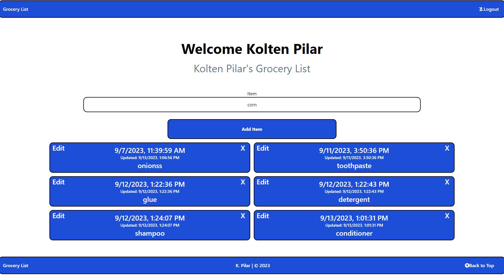
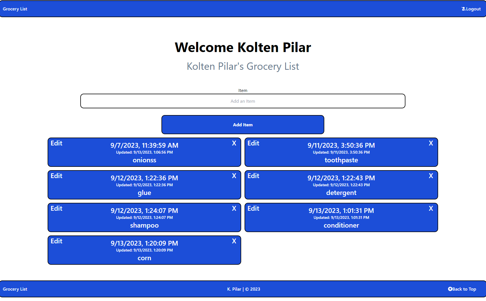
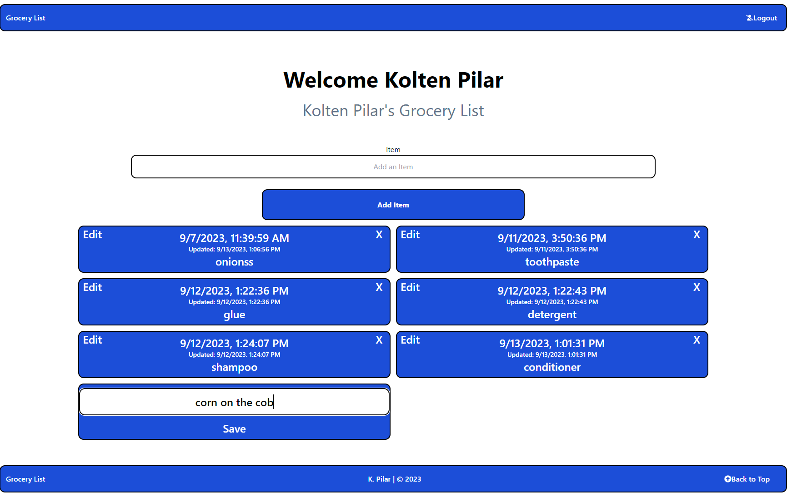
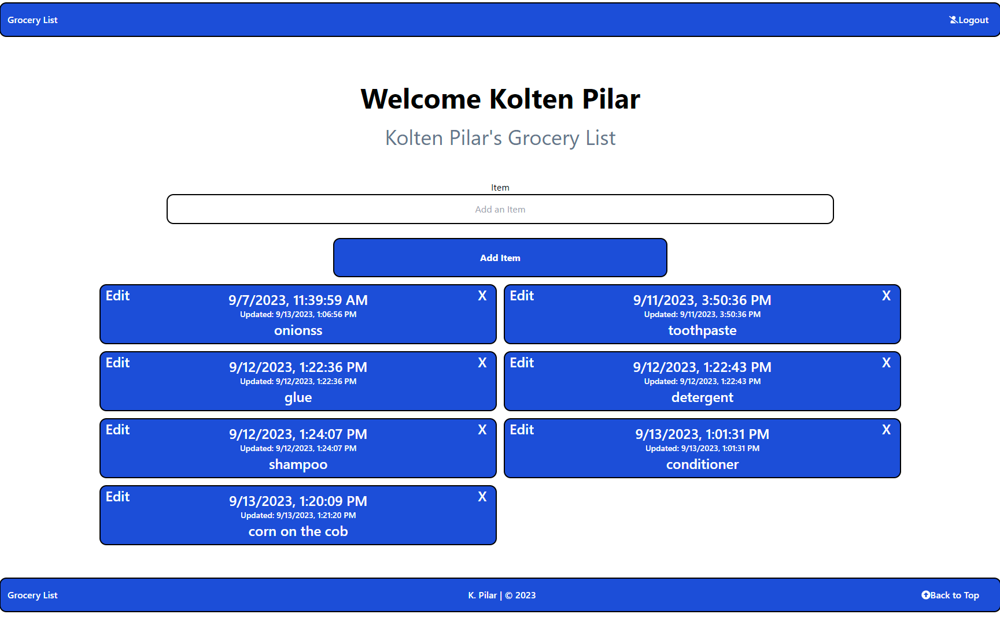

# Grocery List App
# PerScholas / Project 3
## Description/Introduction:
- This is a simple grocery list app that allows users to add, edit, see all list items, and delete items from their grocery list.
 ---The list keeps track of the time and date that the item was added to the list.

- The user can type in the name of the item they want to add to the list, and click the "Add Item" button to add it to the list.

- The user can click the "Edit" button to edit the name of the item.

- The user can click the "Delete" button to delete the item from the list.

<video width='320' height='240' controls>
 <source src='C:\Users\kp\Desktop\SE_Curriculum\Module_3\Project-3\Grocery-App\Delete-demo.mp4' type='video/mp4'>
</video>
 
- The app can keep track of multiple users and their grocery lists with authentication/login.
- The app is based on the MERN practice project I completed during the PerScholas training program.

-----------------------------------------------------------------------------------------------------------------------------------------------------------------

## Technologies Used:
- MongoDB
- Mongoose
- Express
- React+Vite
- Redux
- Node.js
- JavaScript
- HTML
- Tailwind CSS
- Postman

-----------------------------------------------------------------------------------------------------------------------------------------------------------------

## Getting Started:
- Below are my planning documents for this project:
- https://trello.com/invite/b/srzka2mv/ATTI2d494ad42022deae201dc15dca8436efA0EB1599/mod-3-project
- ERD: https://lucid.app/lucidchart/4b85acb0-119d-4713-8e09-62a7dd5a8040/edit?beaconFlowId=3AE5B0EC41E5B5B9&invitationId=inv_c2fdc1ed-4ffb-4e46-8afe-07b6d31847c7&page=0_0#
- *Link to deployed app when live*

-----------------------------------------------------------------------------------------------------------------------------------------------------------------

## Unsolved Problems:
- On the register and login page, the icons are above the words 'login' and 'register' instead of next to them. I tried using flexbox / justify-center / items-center to fix this but it didn't work. I suspect that it is either the way I'm nesting the divs or the way I'm using tailwind classes.

-----------------------------------------------------------------------------------------------------------------------------------------------------------------

## Future Enhancements:
